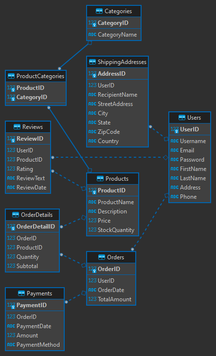

# Online Merchandise Store Project

This project is an example of an online merchandise store with a relational database backend. It includes SQL scripts to create the database tables, populate them with sample data, and demonstrates various SQL queries for data retrieval and analysis.

## Requirements

- **Database System:** You will need a compatible database system to execute the provided SQL scripts and work with the database. SQLite is recommended for this project.

- **Database Client:** A database client is required to interact with the database, run SQL queries, and view the database schema. [DBeaver](https://dbeaver.io/) is what has been used for this project. 

**Important:** SQLite is serverless and it doesn't require a server to run. This project is made for education and training purposes only and thas it the main reason why SQLite is chosen. 

## Database Schema

The database schema consists of the following tables:

- Users: Stores user information such as username, email, and address.
- Products: Contains details about the available products, including name, description, price, and stock quantity.
- Categories: Stores product categories.
- ProductCategories: A many-to-many relationship table linking products to categories.
- Orders: Records order information with user references.
- OrderDetails: Contains details about the products in each order.
- Reviews: Stores user reviews and ratings for products.
- Payments: Records payment information for orders.
- ShippingAddresses: Contains shipping address information associated with users.

## ER Diagram

## Create DB Tables

The create_tables_script.sql file creates all the tables with their corresponding collumns:

## Populated Data

The populate_data_script.files populates the tables with sample data to demonstrate the functionality of the online merchandise store. Sample data includes users, products, categories, orders, reviews, payments, and shipping addresses.

## SQL Queries

The project includes a set of SQL queries that demonstrate common operations, both basic and advanced, on the database:

- Basic Queries (basic_sql_queries.sql):
  - Retrieve all products.
  - Retrieve users who have placed orders.
  - Retrieve product categories for a specific product.
  - Count the number of products in each category.
  - Retrieve user reviews and ratings for a specific product.

- Advanced Queries (advanced_sql_queries.sql):
  - Find products with low stock.
  - Calculate total sales and revenue.
  - Find users with the most orders.
  - Retrieve average rating for each product.
  - Identify users with multiple shipping addresses.

Each query is explained and can be used as a reference for working with the database.

## Getting Started

To use this project, follow these steps:

1. Create the database tables using the provided SQL scripts.
2. Populate the tables with sample data using the provided SQL scripts.
3. Execute the SQL queries to interact with the database and analyze the data.

